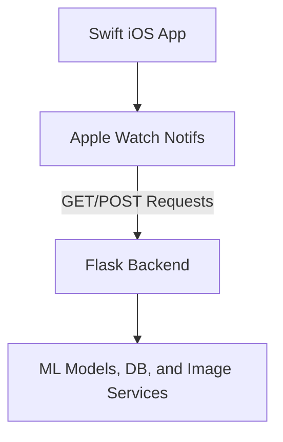

Project Video Link: https://drive.google.com/file/d/1VYe9X_kOqkOutAn1fCih5GzbbteZJdLP/view?usp=sharing


## Inspiration
A family member of someone on our team recently went through terminal brain cancer, which significantly affected his memory capacity. He often found himself unable to remember events from his past. To honor him, we made an app that can help users "time travel" back to different points in their life and experience their own memories. Even if memories aren't stored in your own consciousness, it brings peace of mind to know that they are stored somewhere.

## What it does
Our app gives users the options to store memories in their phone. These are represented as a title, a description, photos, and location data. All black and white images are automatically converted to color, and users have the option to view images as 3d objects and place them in their home using AR tech. Users receive notifications that tell them about different memories in their life throughout the day on their watch so they can always feel connected to their past.

##Tech Stack
###Languages & Frameworks
-  Python (Flask)
-  Swift (iOS / Watch)
-  NLTK (Search)
- ARKit (AR Memories)
- l Transformer Models (3D Generation & Colorization)
- JSON (Data Storage)

### Other Tools
- Apple Watch Notifications
- REST APIs
- PyTorch / NumPy (Model inference)
- Local image handling with Flask
- Custom UUID & keyword indexing system

## How we built it
We decided to have a flask server as a backend, storing all memories and user data. When the user interacts with the swift frontend, they make get a post requests to transfer information. This allows us to run some of our deep learning models on an external device to improve load balancing and performance.

## Challenges we ran into
We had a couple difficult obstacles to traverse while trying to setup image to 3d image that is viewable in AR-kit. This was very difficult to implement as there were different file types moving across get and post requests, and lots of different requirements to run complex transformer models for generating the 3d files.

## Accomplishments that we're proud of
We are very proud of our final product we achieved. We worked through the night to integrate all of our processes and make sure that the app is running smoothly. We are very glad that our ambitiously large app idea ended up coming into fruition, as we were worried for some time that our scope was going to be too large.

## What we learned
We learned a lot about integrating different libraries and models into one cohesive backend. We also used AR-kit for one of our first times ever, and we learned a lot about how to manage it. Additionally, we learned about specific machine learning techniques like interpolation of perspectives to form a cohesive 3D model.

## What's next for Remembrane
In the future, we hope to improve our search algorithm by including emotional factors. This would mean analyzing the emotional sentiment of the title and description of each memory, and possibly tracking biometric statistics while the user is viewing it. This way if the user searches something like "Take me back in time to a happy memory," we can service that query.

## Memory format
```json
{
  "id": "m_003",
  "location": {
    "coordinates": {
      "lng": -118.49695659476029,
      "lat": 34.01331323267029
    },
    "name": "FAANG hq"
  },
  "media": {
    "images": [
      "EB630982-02A8-4859-976F-846B50A79831.jpg",
      "73F20E47-1E12-4430-8CB1-14A601262883.jpg"
    ]
  },
  "description": "This is the first time I interviewed for a corporate office job. I succeed and I got the job and I was hired on the spot. My experience was invaluable.",
  "timestamp": "1959-01-18T10:41:00Z",
  "title": "First interview ever",
  "keywords": [
    "corporate office job",
    "first time",
    "job",
    "succeed",
    "spot",
    "invaluable",
    "interview",
    "hired",
    "experience"
  ]
}
```

## API Endpoints
- GET    /search                     → Search memories by keyword, time, and relationships
- GET    /memory/random   → Get a random memory
- GET    /memory/<id>         → Fetch full memory data by ID
- GET    /timeline                   → Get compressed memory cards for timeline view
- POST   /memory/upload   → Upload a new memory to the system
- POST   /color                      → Colorize a black-and-white image
- GET    /memories/recent  → Get recently added memories

## Our Impact
Remembrane was built not just to archive information, but to preserve connection. Whether a user is experiencing memory loss due to age or illness, or simply wants a richer sense of their life story, Remembrane empowers them to relive moments they may otherwise forget. Our app makes the past feel accessible and comforting — offering peace of mind that memories, once made, are never truly lost.

## Fostering Innovation
We set out to create more than a journal or photo album. Remembrane bridges cutting-edge technology — like neural-based image colorization, AR object placement, and semantic search with natural language — into a deeply human tool. We're proud to merge modern machine learning and emotional design into a user-first mobile experience that innovates at the intersection of tech and empathy.

## Stack Diagram


