# Remembrane

Remembrane is an iOS and Apple Watch app that helps users preserve, recall, and relive meaningful life memories — combining AR, deep learning, and mobile development into a powerful memory preservation tool.

[Watch the Project Video](https://drive.google.com/file/d/1VYe9X_kOqkOutAn1fCih5GzbbteZJdLP/view?usp=sharing)

---

## Inspiration

A family member of someone on our team recently went through terminal brain cancer, which significantly affected his memory capacity. He often found himself unable to remember events from his past. To honor him, we made an app that can help users "time travel" back to different points in their life and experience their own memories. Even if memories aren't stored in your own consciousness, it brings peace of mind to know that they are stored somewhere.

---

## What It Does

Remembrane allows users to store memories on their phone, including a title, description, photos, and location data.

- Black-and-white images are automatically colorized using a deep learning model.
- Memories can be rendered as 3D objects using a custom transformer pipeline and placed into the user's environment with ARKit.
- Apple Watch notifications keep the user connected to their memories throughout the day.

---

## Tech Stack

### Languages & Frameworks
- Python (Flask)
- Swift (iOS + Apple Watch)
- ARKit (AR Memories)
- NLTK (Search)
- Transformer Models (Colorization & 3D Reconstruction)
- JSON (Data Storage)

### Tools & Libraries
- PyTorch / NumPy (Model inference)
- REST APIs
- Apple WatchKit
- Local image processing (Flask)
- Custom UUID and keyword indexing

---

## How We Built It

- A Flask backend handles all memory storage, indexing, and model inference.
- The iOS frontend communicates with the backend using GET and POST requests.
- ARKit and 3D generation run client-side, while heavy ML workloads are offloaded to the backend server.
- A custom memory format stores detailed metadata including geolocation and keyword tags.

---

## Challenges We Ran Into

- Generating 3D content from 2D images was a major technical hurdle, especially with model constraints, file type compatibility, and streaming data across requests.
- Integrating ARKit into our app required learning its rendering and interaction models from scratch.
- Deep learning model performance and latency required fine-tuning for smooth user experience.

---

## Accomplishments

- Integrated AR, image colorization, and natural language search into a seamless app experience.
- Deployed deep learning models within a performant and scalable architecture.
- Successfully implemented Apple Watch integration to deliver memory-based notifications.

---

## What We Learned

- How to manage deep learning pipelines and model serving across a client-server mobile system.
- Best practices for interfacing with ARKit and Swift UI rendering for 3D objects.
- Semantic and emotional search through natural language processing and embeddings.

---

## What's Next

We hope to incorporate emotion-based memory retrieval. For example, a user could say "Take me back in time to a happy memory" and we would use sentiment analysis of titles and descriptions — and potentially biometric data — to surface emotionally resonant moments.

---

## Memory Format

```json
{
  "id": "m_003",
  "location": {
    "coordinates": {
      "lng": -118.49695659476029,
      "lat": 34.01331323267029
    },
    "name": "FAANG hq"
  },
  "media": {
    "images": [
      "EB630982-02A8-4859-976F-846B50A79831.jpg",
      "73F20E47-1E12-4430-8CB1-14A601262883.jpg"
    ]
  },
  "description": "This is the first time I interviewed for a corporate office job. I succeed and I got the job and I was hired on the spot. My experience was invaluable.",
  "timestamp": "1959-01-18T10:41:00Z",
  "title": "First interview ever",
  "keywords": [
    "corporate office job",
    "first time",
    "job",
    "succeed",
    "spot",
    "invaluable",
    "interview",
    "hired",
    "experience"
  ]
}
```

---

## API Endpoints

| Method | Endpoint                 | Description                                     |
|--------|--------------------------|-------------------------------------------------|
| GET    | `/search`                | Search memories by keyword, time, and tags      |
| GET    | `/memory/random`         | Fetch a random memory                          |
| GET    | `/memory/<id>`           | Fetch full memory data by ID                   |
| GET    | `/timeline`              | Get timeline view of memories                  |
| POST   | `/memory/upload`         | Upload a new memory                            |
| POST   | `/color`                 | Colorize a black-and-white image               |
| GET    | `/memories/recent`       | Get recently added memories                    |

---

## Our Impact

Remembrane was built not just to archive information, but to preserve connection. Whether a user is experiencing memory loss due to age or illness, or simply wants a richer sense of their life story, Remembrane empowers them to relive moments they may otherwise forget. Our app makes the past feel accessible and comforting — offering peace of mind that memories, once made, are never truly lost.

---

## Fostering Innovation

We set out to create more than a journal or photo album. Remembrane bridges cutting-edge technology — like neural-based image colorization, AR object placement, and semantic search with natural language — into a deeply human tool. We're proud to merge modern machine learning and emotional design into a user-first mobile experience that innovates at the intersection of tech and empathy.

---

## Stack Diagram

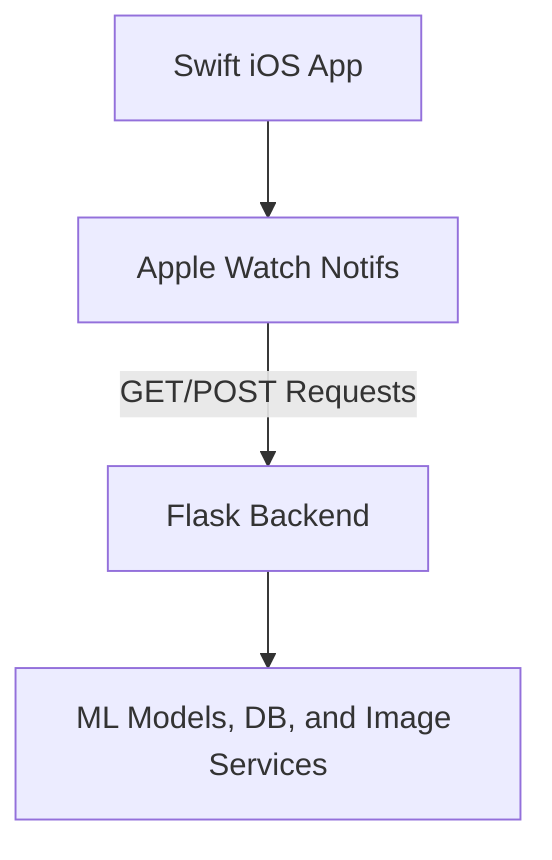

---

## Project Screenshots

### Slides

| Slide 1 | Slide 2 | Slide 3 |
|--------|--------|--------|
| 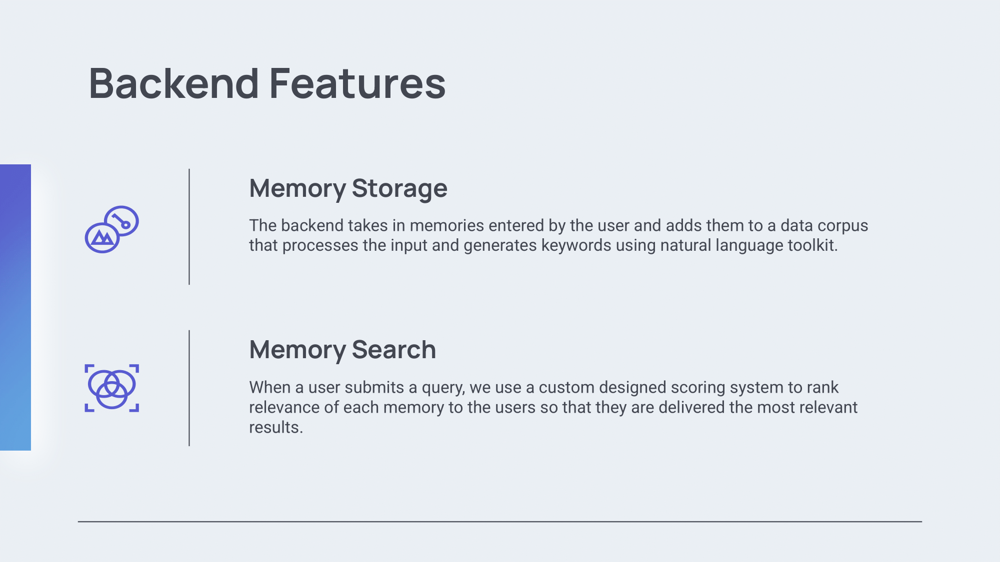 | 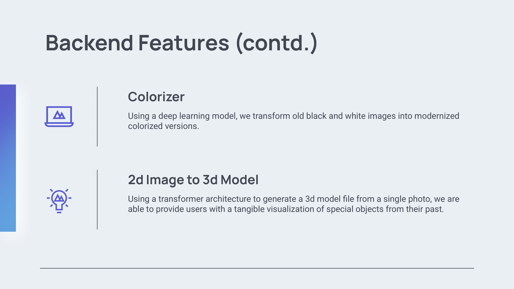 | 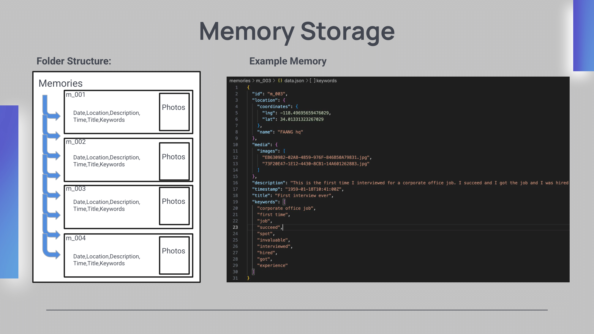 |

| Slide 4 | Slide 5 | Slide 6 |
|--------|--------|--------|
| 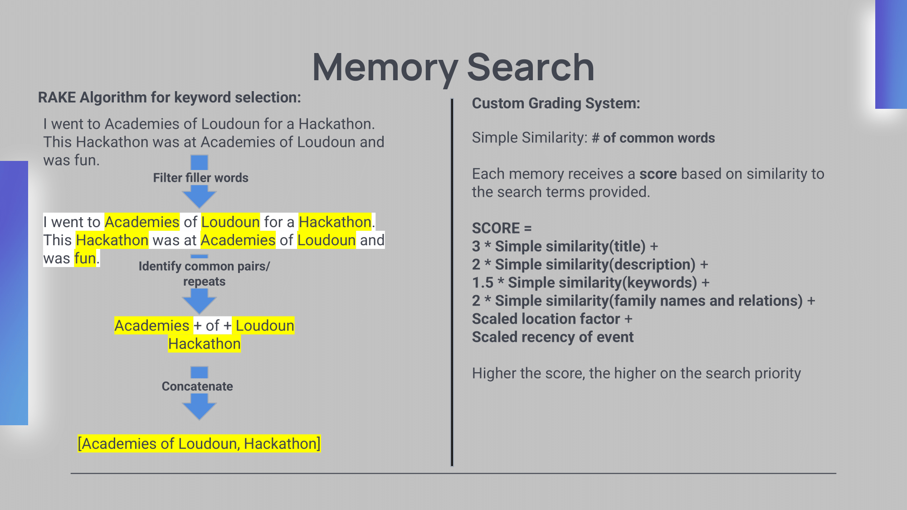 | 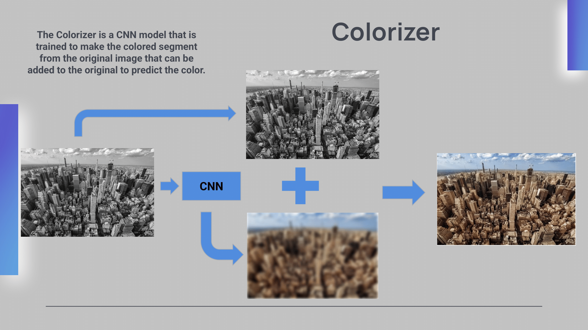 | 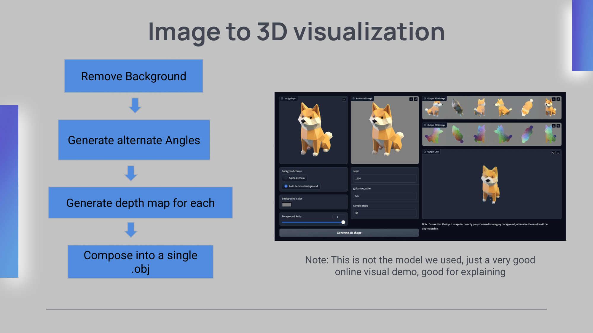 |

---

### App Images

<div style="display: flex; gap: 10px;">
    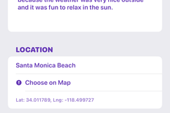
    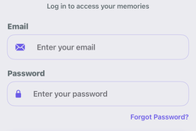
    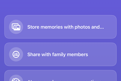
    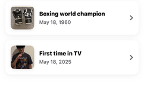
    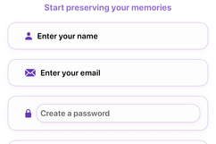
</div>

